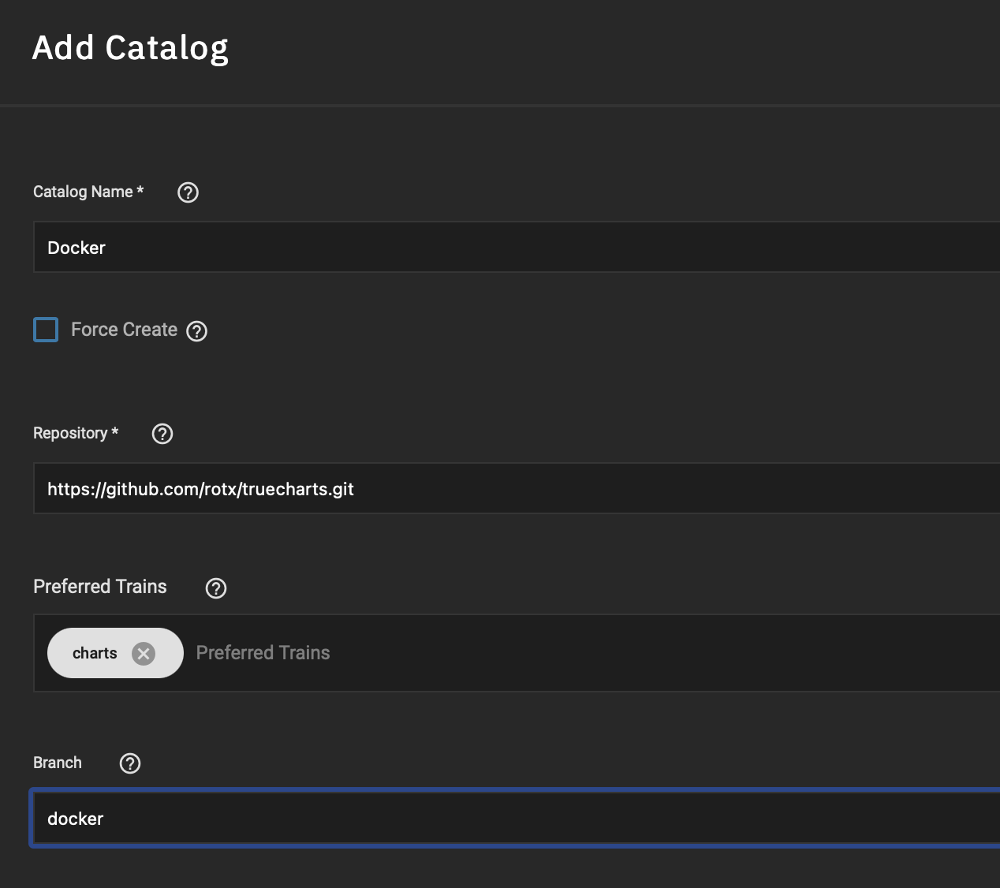
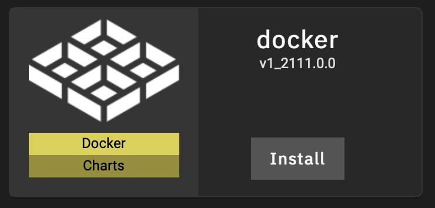

# Docker Chart

This repository is a fork of the [TrueCharts](https://github.com/truecharts/catalog/tree/main/stable) apps, and customizes the “custom-app” chart with the following additions:

* Allows setting external interfaces (and static IP addresses) similar to the default “iX-chart” used by the GUI for “Launch Docker Image”, for use cases such as [Homebridge](https://homebridge.io/).
* Allows specifying container command and argument (for example, “sleep”, “infinity” for a debian:stable container).

Unlike the built-in iX-chart, this chart makes it easy to integrate ingress with Truechart’s Traefik.

## Installation

To use this catalog, go to “Apps”, “Manage Catalogs” in the TrueNAS SCALE GUI and click “Add Catalog”.

Assign a name (e.g., `Docker`), and use `https://github.com/rotx/truecharts.git` as the catalog repository URL with branch `docker`. The preferred train should be the default (`charts`).

## Launching Docker Images

To use the new chart and launch a docker image, go to “Available Applications” and click on “Install” for “docker”. The GUI will present options that are similar to the built-in “Launch Docker Image”, with the additional enhancements listed above.

